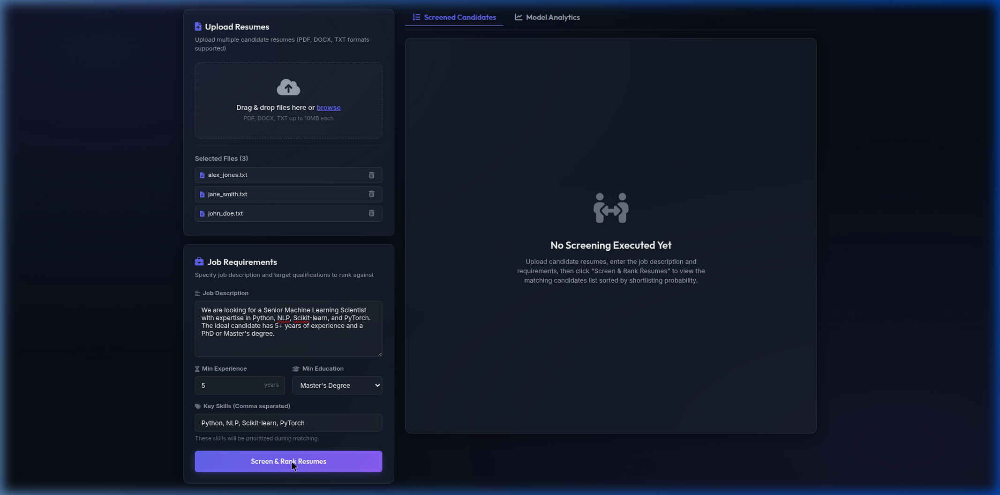
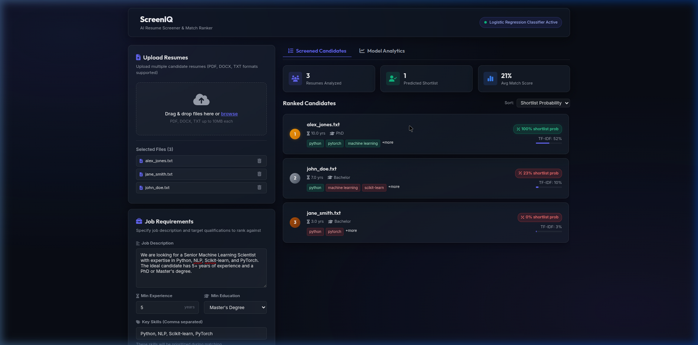
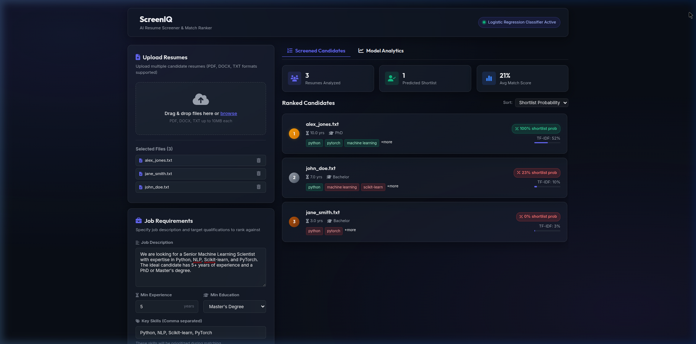

# ScreenIQ: AI-Powered Resume Screener & Job Match Ranker

An end-to-end NLP and machine learning pipeline that parses resumes against a job description, scores their textual relevance, and predicts their shortlisting probability using a Logistic Regression classifier trained on HR decision data.


## Dashboard Preview

### 1. Requirements Setup & Resume Upload


### 2. Screened & Ranked Candidates


### 3. Detailed Match Alignment Drawer


---

## Features

- **Multi-format Resume Parsing:** Extracts and cleans text from PDF, DOCX, and TXT files.
- **NLP Relevance Ranking:** Computes Cosine Similarity between resumes and job descriptions using TF-IDF vectorization.
- **Logistic Regression Shortlist Classifier:** Predicts shortlisting probability using key structural metrics:
  - Textual Cosine Similarity (TF-IDF)
  - Key Skills Overlap Ratio
  - Years of Experience Alignment
  - Highest Education Level Matching
- **Premium SPA Interface:** A dark-themed, glassmorphism dashboard containing:
  - Drag-and-drop resume uploading.
  - Interactive job requirements input forms.
  - Real-time rankings list sorted by shortlisting probability.
  - Candidate details drawer presenting skills matches/gaps and resume previews.
  - Classifier Analytics displaying active weights (coefficients) and validation metrics (Accuracy, Precision, Recall, ROC-AUC) using Chart.js.
  - On-demand retraining trigger.
- **Containerized Deployment:** Docker and Docker Compose configuration.

---

## Directory Structure

```
Resume_Screener/
├── backend/
│   ├── app/
│   │   ├── __init__.py
│   │   ├── main.py            # FastAPI main application & routers
│   │   ├── parser.py          # PDF/DOCX/TXT text & feature extractor
│   │   ├── ml.py              # TF-IDF, synthetic dataset, & Logistic Regression model
│   │   └── static/            # Static assets (HTML, CSS, JS)
│   │       ├── index.html     
│   │       ├── css/
│   │       │   └── style.css  
│   │       └── js/
│   │           └── app.js     
│   └── requirements.txt       # Backend Python dependencies
├── Dockerfile                 # Multi-stage production build
├── docker-compose.yml         # Container mapping configuration
├── run.sh                     # Local development bootstrapping script
└── README.md                  # Project documentation
```

---

## Getting Started

### Method 1: Local Development (Bootstrap Script)

Run the shell script to create a virtual environment, bootstrap pip (if missing), install requirements, train the classifier, and launch the Uvicorn development server:

```bash
chmod +x run.sh
./run.sh
```

The application will be available at: **http://localhost:8000**

### Method 2: Running with Docker Compose

Ensure Docker and Docker Compose are installed, then spin up the application container:

```bash
docker-compose up --build
```

The application will expose port `8000` at: **http://localhost:8000**

---

## API Endpoints

### 1. Screen & Rank Resumes
* **Endpoint:** `POST /api/rank`
* **Content-Type:** `multipart/form-data`
* **Form Parameters:**
  - `job_description` (string, required): Full text of the job description.
  - `min_experience` (float, optional): Required years of experience.
  - `required_skills` (string, optional): Comma-separated list of priority skills.
  - `required_education` (string, optional): "High School", "Associate", "Bachelor", "Master", or "PhD".
  - `resumes` (files, required): List of files to analyze.

### 2. Get Model Statistics
* **Endpoint:** `GET /api/model-stats`
* **Response:** JSON containing coefficients, Accuracy, Precision, Recall, and ROC-AUC evaluation metrics.

### 3. Retrain Classifier
* **Endpoint:** `POST /api/train`
* **Response:** Triggers retraining on the synthetic dataset and returns updated validation metrics.
